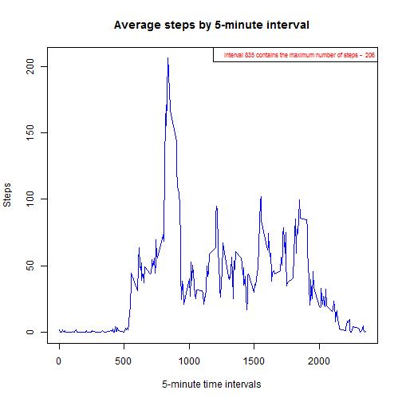

Reproducible Research: Peer Assessment 1
========================================================
06/05/2016

## Loading and preprocessing the data
Show any code that is needed to  
1. Load the data (i.e. `read.csv()`)  
2. Process/transform the data (if necessary) into a format suitable for your analysis  

```r
require("ggplot2")
```

```
## Loading required package: ggplot2
```

```
## Warning: package 'ggplot2' was built under R version 3.2.5
```

```r
require("lubridate")
```

```
## Loading required package: lubridate
```

```
## Warning: package 'lubridate' was built under R version 3.2.5
```

```
## 
## Attaching package: 'lubridate'
```

```
## The following object is masked from 'package:base':
## 
##     date
```

```r
require("lattice")
```

```
## Loading required package: lattice
```

```
## Warning: package 'lattice' was built under R version 3.2.5
```

```r
# Set variables
dataDir <- "./data"
zipFile <- "./data/Dataset.zip"
zipUrl <- "https://d396qusza40orc.cloudfront.net/repdata%2Fdata%2Factivity.zip"
dataFile <- "./data/activity.csv"

# Create /data directory if not exists download the archive
if(!file.exists(dataDir)){dir.create(dataDir)}

# Skips the download step if the archive is already downloaded and unzipped
if (!file.exists(dataFile)){
  download.file(zipUrl, destfile = zipFile)
  unzip(zipFile, exdir=dataDir)
  file.remove(zipFile)
}

# Reading the source file
data = read.csv('./data/activity.csv', header = TRUE)
```

## What is mean total number of steps taken per day?  
For this part of the assignment, you can ignore the missing values in the dataset.   
1. Make a histogram of the total number of steps taken each day   
2. Calculate and report the mean and median total number of steps taken per day  

```r
# Aggregate steps by day
aggrStepsByDay <- aggregate(steps ~ date, data, sum)

# Calculate mean and median
aggrStepsMean <-round(mean(aggrStepsByDay$steps, na.rm = TRUE),2)
aggrStepsMedian <-median(aggrStepsByDay$steps, na.rm = TRUE)

# Generate the required plot
gplot <- ggplot(aggrStepsByDay, aes(factor(date), steps))+
         geom_bar(stat="identity") +
         geom_hline(aes ( yintercept = aggrStepsMean), size = 1, color = "red", alpha = 1.0)+
         geom_hline(aes ( yintercept = aggrStepsMedian), size = 1, color = "blue",     linetype="dashed", alpha = 1.0)+
         geom_text(aes(label = paste("Mean =", aggrStepsMean),'2012-10-15',19300), color = "red") +
         geom_text(aes(label = paste("Median =", aggrStepsMedian),'2012-10-15',18000), color = "blue") +
         xlab("Date") +
         theme(axis.text.x=element_text(angle=90,hjust=1,vjust=0.5))+
         ylab(expression('Total number of steps')) +
         ggtitle('Total number of steps taken each day') 
print(gplot)
```


## What is the average daily activity pattern?  
1. Make a time series plot (i.e. `type = "l"`) of the 5-minute interval (x-axis) and the average number of steps taken, averaged across all days (y-axis)  
2. Which 5-minute interval, on average across all the days in the dataset, contains the maximum number of steps?    

```r
# Aggregate steps by 5-min interval
aggrStepsByInterval <- aggregate(steps ~ interval, data, FUN=mean)

# Generate the required plot
plot(aggrStepsByInterval, 
     type="l",
     col="blue", 
     xlab="5-minute time intervals",
     ylab="Steps",
     main="Average steps by 5-minute interval")

# Sort steps column highest to lowest
aggrStepsByInterval <- aggrStepsByInterval[order(-aggrStepsByInterval$steps) , ]

# Add a legend
legend("topright",
       legend = paste("Interval", aggrStepsByInterval[1,]$interval,
       "contains the maximum number of steps - ", round(aggrStepsByInterval[1,]$steps,0)),
       text.col = 'red', 
       cex = 0.65)
```



## Imputing missing values     
Note that there are a number of days/intervals where there are missing values (coded as `NA`). The presence of missing days may introduce bias into some calculations or summaries of the data.   
1. Calculate and report the total number of missing values in the dataset (i.e. the total number of rows with `NA`s)    
2. Devise a strategy for filling in all of the missing values in the dataset. The strategy does not need to be sophisticated. For example, you could use the mean/median for that day, or the mean for that 5-minute interval, etc.    
3. Create a new dataset that is equal to the original dataset but with the missing data filled in.    
4. Make a histogram of the total number of steps taken each day and Calculate and report the mean and median total number of steps taken per day. Do these values differ from the estimates from the first part of the assignment? What is the impact of imputing missing data on the estimates of the total daily number of steps?  

```r
# Report the total number of missing values in the dataset 
sum(is.na(data$steps))
```

```
## [1] 2304
```

```r
# Missing data imputation
data[,"imputedSteps"] <- data[["steps"]]
data$imputedSteps[is.na(data$imputedSteps)] = mean(data$steps, na.rm=TRUE)

# Aggregate steps by day
aggrStepsByDay <- aggregate(imputedSteps ~ date, data, sum)

# Calculate mean and median
aggrStepsMean <-round(mean(aggrStepsByDay$imputedSteps),2)
aggrStepsMedian <-round(median(aggrStepsByDay$imputedSteps),2)

# Generate the required plot
plot <- ggplot(aggrStepsByDay, aes(factor(date), imputedSteps))+
         geom_bar(stat="identity") +
         geom_hline(aes ( yintercept = aggrStepsMean), size = 1, color = "orange", alpha = 1.0)+
         geom_hline(aes ( yintercept = aggrStepsMedian), size = 1, color = "blue",     linetype="dashed", alpha = 1.0)+
         geom_text(aes(label = paste("Mean =", aggrStepsMean),'2012-10-15',19300), color = "orange") +
         geom_text(aes(label = paste("Median =", aggrStepsMedian),'2012-10-15',18000), color = "blue") +
         xlab("Date") +
         theme(axis.text.x=element_text(angle=90,hjust=1,vjust=0.5))+
         ylab(expression('Total number of steps')) +
         ggtitle('Total number of steps taken each day (after the imputation of missing values)') 
print(plot)
```


## Are there differences in activity patterns between weekdays and weekends?       
For this part the `weekdays()` function may be of some help here. Use the dataset with the filled-in missing values for this part.    
1. Create a new factor variable in the dataset with two levels -- "weekday" and "weekend" indicating whether a given date is a weekday or weekend day.    
2. Make a panel plot containing a time series plot (i.e. `type = "l"`) of the 5-minute interval (x-axis) and the average number of steps taken, averaged across all weekday days or weekend days (y-axis).     


```r
# Define the day of week
data[,"day"] <- ifelse(wday(as.Date(data$date, "%Y-%m-%d")) %in% c(7,1), 'Weekend', 'Weekday')

# Aggregate steps by 5-min interval
aggrStepsByIntervalWeekday <- aggregate(steps~interval+day, data, FUN=mean)

# Generate the required plot
xyplot(data=aggrStepsByIntervalWeekday, steps~interval|day,
       type = 'l',
       layout = c(1,2),
       col="blue", 
       xlab="5-minute time intervals",
       ylab="Steps",
       main=list(label="Average steps by 5-minute interval", cex=1.2),
       scales=list(cex=0.7)
     )
```


